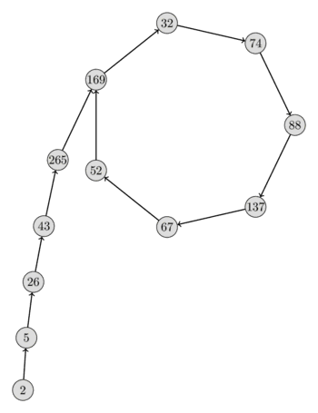

# მთელი რიცხვების ფაქტორიზაცია

ამ სტატიაში ჩვენ ჩამოვთვლით რამდენიმე ალგორითმს მთელი რიცხვების ფაქტორიზაციისთვის, რომელთაგან თითოეული შეიძლება იყოს სწრაფი ან განსხვავებული დონის ნელი, მათი შეყვანის მიხედვით.

გაითვალისწინეთ, თუ რიცხვი, რომლის ფაქტორიზაციაც გსურთ, რეალურად არის მარტივი რიცხვი, ალგორითმების უმეტესობა ძალიან ნელა იმუშავებს. ეს განსაკუთრებით ეხება ფერმატის, პოლარდის p-1 და პოლარდის rho ფაქტორიზაციის ალგორითმებს.
მაშასადამე, ყველაზე ლოგიკურია, რომ შევასრულოთ ალბათური (ან სწრაფი დეტერმინისტი) [პირველობის ტესტი](primality_tests.md), სანამ ცდილობთ რიცხვის ფაქტორიზაციას.

## საცდელი განყოფილება

ეს არის ყველაზე ძირითადი ალგორითმი ძირითადი ფაქტორიზაციის მოსაძებნად.

ჩვენ ვყოფთ თითოეულ შესაძლო გამყოფზე $d$.
შეიძლება შეამჩნიოთ, რომ შეუძლებელია $n$ შედგენილი რიცხვის ყველა ძირითადი ფაქტორი იყოს $\sqrt{n}$-ზე დიდი.
ამიტომ, ჩვენ გვჭირდება მხოლოდ $2 \le d \le \sqrt{n}$ გამყოფების ტესტირება, რაც გვაძლევს პირველ ფაქტორიზაციას $O(\sqrt{n})$-ში.
(ეს არის [pseudo-polynomial time](https://en.wikipedia.org/wiki/Pseudo-polynomial_time), ანუ პოლინომია შეყვანის მნიშვნელობით, მაგრამ ექსპონენციალური შეყვანის ბიტების რაოდენობაში.)

უმცირესი გამყოფი უნდა იყოს მარტივი რიცხვი.
ჩვენ ვხსნით ფაქტორებულ ნომერს და ვაგრძელებთ პროცესს.
თუ ჩვენ ვერ ვიპოვით გამყოფს $[2-ის დიაპაზონში; \sqrt{n}]$, მაშინ რიცხვი თავად უნდა იყოს მარტივი.

```{.cpp file=factorization_trial_division1}
vector<long long> trial_division1(long long n) {
    vector<long long> factorization;
    for (long long d = 2; d * d <= n; d++) {
        while (n % d == 0) {
            factorization.push_back(d);
            n /= d;
        }
    }
    if (n > 1)
        factorization.push_back(n);
    return factorization;
}
```

### ბორბლების ფაქტორიზაცია

ეს არის საცდელი განყოფილების ოპტიმიზაცია.
მას შემდეგ რაც ვიცით, რომ რიცხვი არ იყოფა 2-ზე, არ გვჭირდება სხვა ლუწი რიცხვების შემოწმება.
ეს გვიტოვებს მხოლოდ $50\%$ ნომრების შესამოწმებლად.
2-ის გაანგარიშების შემდეგ და კენტი რიცხვის მიღების შემდეგ, შეგვიძლია უბრალოდ დავიწყოთ 3-ით და მხოლოდ სხვა კენტი რიცხვების დათვლა.

```{.cpp file=factorization_trial_division2}
vector<long long> trial_division2(long long n) {
    vector<long long> factorization;
    while (n % 2 == 0) {
        factorization.push_back(2);
        n /= 2;
    }
    for (long long d = 3; d * d <= n; d += 2) {
        while (n % d == 0) {
            factorization.push_back(d);
            n /= d;
        }
    }
    if (n > 1)
        factorization.push_back(n);
    return factorization;
}
```

ეს მეთოდი შეიძლება კიდევ უფრო გაფართოვდეს.
თუ რიცხვი არ იყოფა 3-ზე, ჩვენ ასევე შეგვიძლია უგულებელვყოთ 3-ის ყველა სხვა ჯერადი მომავალი გამოთვლებით.
ასე რომ, ჩვენ მხოლოდ უნდა შევამოწმოთ რიცხვები $5, 7, 11, 13, 17, 19, 23, \dots$.
ჩვენ შეგვიძლია დავაკვირდეთ ამ დარჩენილი რიცხვების ნიმუშს.
ჩვენ უნდა შევამოწმოთ ყველა რიცხვი $d \bmod 6 = 1$ და $d \bmod 6 = 5$.
ასე რომ, ეს გვიტოვებს მხოლოდ $33.3\%$ პროცენტი რიცხვების შესამოწმებლად.
ჩვენ შეგვიძლია ეს განვახორციელოთ 2-ისა და 3-ის პირველი რიცხვების ფაქტორინგით, რის შემდეგაც ვიწყებთ 5-ით და ვითვლით მხოლოდ $1$ და $5$ მოდულს $6$.

აქ არის დანერგვა ძირითადი ნომრისთვის 2, 3 და 5.
მოსახერხებელია გამოტოვებული ნაბიჯების მასივში შენახვა.

```{.cpp file=factorization_trial_division3}
vector<long long> trial_division3(long long n) {
    vector<long long> factorization;
    for (int d : {2, 3, 5}) {
        while (n % d == 0) {
            factorization.push_back(d);
            n /= d;
        }
    }
    static array<int, 8> increments = {4, 2, 4, 2, 4, 6, 2, 6};
    int i = 0;
    for (long long d = 7; d * d <= n; d += increments[i++]) {
        while (n % d == 0) {
            factorization.push_back(d);
            n /= d;
        }
        if (i == 8)
            i = 0;
    }
    if (n > 1)
        factorization.push_back(n);
    return factorization;
}
```

თუ გავაგრძელებთ ამ მეთოდის გაფართოებას კიდევ უფრო მეტი მარტივი რიცხვების ჩათვლით, უკეთესი პროცენტების მიღწევა შესაძლებელია, მაგრამ გამოტოვების სიები უფრო დიდი გახდება.

### წინასწარ გამოთვლილი primes

ბორბლების ფაქტორიზაციის მეთოდის განუსაზღვრელი ვადით გაფართოებით, ჩვენ მხოლოდ მარტივი რიცხვები დაგვრჩება შესამოწმებლად.
ამის შესამოწმებლად კარგი გზაა ყველა მარტივი რიცხვის წინასწარ გამოთვლა [ერატოსთენეს საცერი](Sieve-of-eratosthenes.md) $\sqrt{n}$-მდე და ცალ-ცალკე გამოცდა.

```{.cpp file=factorization_trial_division4}
vector<long long> primes;

vector<long long> trial_division4(long long n) {
    vector<long long> factorization;
    for (long long d : primes) {
        if (d * d > n)
            break;
        while (n % d == 0) {
            factorization.push_back(d);
            n /= d;
        }
    }
    if (n > 1)
        factorization.push_back(n);
    return factorization;
}
```

## ფერმას ფაქტორიზაციის მეთოდი

ჩვენ შეგვიძლია დავწეროთ კენტი შედგენილი რიცხვი $n = p \cdot q$, როგორც სხვაობა ორი კვადრატის $n = a^2 - b^2$:

$$n = \left(\frac{p + q}{2}\right)^2 - \left(\frac{p - q}{2}\right)^2$$

ფერმას ფაქტორიზაციის მეთოდი ცდილობს გამოიყენოს ეს ფაქტი $a^2$-ის პირველი კვადრატის გამოცნობით და შეამოწმოს, არის თუ არა დარჩენილი ნაწილი, $b^2 = a^2 - n$, ასევე კვადრატული რიცხვი.
თუ ასეა, მაშინ ჩვენ ვიპოვეთ $a - b$ და $a + b$ $n$-ის ფაქტორები.

```cpp
int fermat(int n) {
    int a = ceil(sqrt(n));
    int b2 = a*a - n;
    int b = round(sqrt(b2));
    while (b * b != b2) {
        a = a + 1;
        b2 = a*a - n;
        b = round(sqrt(b2));
    }
    return a - b;
}
```

ეს ფაქტორიზაციის მეთოდი შეიძლება იყოს ძალიან სწრაფი, თუ განსხვავება ორ ფაქტორს შორის $p$ და $q$ მცირეა.
ალგორითმი მუშაობს $O(|p - q|)$ დროში.
თუმცა პრაქტიკაში ეს მეთოდი იშვიათად გამოიყენება. როგორც კი ფაქტორები ერთმანეთისგან უფრო დაშორდებიან, ის ძალიან ნელია.

თუმცა, ჯერ კიდევ არსებობს ოპტიმიზაციის უამრავი ვარიანტი ამ მიდგომასთან დაკავშირებით.
$a^2$ მოდულის ფიქსირებული მცირე რიცხვის კვადრატების დათვალიერებით, შეიძლება შეამჩნიოთ, რომ გარკვეული მნიშვნელობები $a$ არ არის საჭირო, რომ ნახოთ, რადგან მათ არ შეუძლიათ აწარმოონ კვადრატული რიცხვი $a^2 - n$.


## პოლარდის $p - 1$ მეთოდი { data-toc-label="Pollard's <script type='math/tex'>p - 1</script> method" }

ძალიან სავარაუდოა, რომ რიცხვის მინიმუმ ერთი ფაქტორი იყოს $B$**-powersmooth** მცირე $B$-ისთვის.
$B$-powersmooth means that every prime power $d^k$ that divides $p-1$ is at most $B$.
Მაგალითად. $4817191$-ის ძირითადი ფაქტორიზაცია არის $1303 \cdot 3697$.
და ფაქტორები არის $31$-powersmooth და $16$-powersmooth, რადგან $1303 - 1 = 2 \cdot 3 \cdot 7 \cdot 31$ და $3697 - 1 = 2^4 \cdot 3 \cdot 7 \cdot 11$.
1974 წელს ჯონ პოლარდმა გამოიგონა მეთოდი შედგენილი რიცხვიდან $B$-ძალიან გლუვი ფაქტორების ამოღების მიზნით.

იდეა მოდის [ფერმატის პატარა თეორემადან](phi-function.md#application).
დაე, $n$-ის ფაქტორიზაცია იყოს $n = p \cdot q$.
იგი ამბობს, რომ თუ $a$ არის coprime to $p$, შემდეგი განცხადება მოქმედებს:

$$a^{p - 1} \equiv 1 \pmod{p}$$

ეს იმასაც ნიშნავს

$$a^{(p - 1)^k} \equiv a^{k \cdot (p - 1)} \equiv 1 \pmod{p}.$$

ასე რომ, ნებისმიერი $M$-ისთვის $p - 1 ~|~ M$-ისთვის ვიცით, რომ $a^M \equiv 1$.
ეს ნიშნავს, რომ $a^M - 1 = p \cdot r$, და ამის გამო ასევე $p ~|~ \gcd(a^M - 1, n)$.

მაშასადამე, თუ $p - 1$ $p$-ის $n$-ის ფაქტორზე ყოფს $M$-ს, ჩვენ შეგვიძლია გამოვყოთ ფაქტორი [ევკლიდის ალგორითმის](euclid-algorithm.md) გამოყენებით.

ნათელია, რომ უმცირესი $M$, რომელიც არის ყოველი $B$-powersmooth რიცხვის ჯერადი არის $\text{lcm}(1,~2~,3~,4~,~\წერტილები,~B)$ .
ან ალტერნატიულად:

$$M = \prod_{\text{prime } q \le B} q^{\lfloor \log_q B \rfloor}$$

გაითვალისწინეთ, თუ $p-1$ ყოფს $M$-ს ყველა უბრალო ფაქტორზე $p$ $n$-ზე, მაშინ $\gcd(a^M - 1, n)$ იქნება $n$.
ამ შემთხვევაში ჩვენ არ ვიღებთ ფაქტორს.
ამიტომ, ჩვენ შევეცდებით $\gcd$-ის მრავალჯერ შესრულებას, ხოლო ჩვენ გამოვთვალოთ $M$.

ზოგიერთ კომპოზიციურ რიცხვს არ აქვს $B$-ძალიან გლუვი ფაქტორები მცირე $B$-ისთვის.
მაგალითად, კომპოზიციური რიცხვის ფაქტორები $100~000~000~000~000~493 = 763~013 \cdot 131~059~365~961$ არის $190~753$-ძალა და 1~092~161~383$. -ძალიან გლუვი.
ჩვენ მოგვიწევს ავირჩიოთ $B >= 190~753$ რიცხვის ფაქტორიზაციისთვის.

შემდეგ განხორციელებაში ვიწყებთ $B = 10$-ით და ვამატებთ $B$ ყოველი გამეორების შემდეგ.

```{.cpp file=factorization_p_minus_1}
long long pollards_p_minus_1(long long n) {
    int B = 10;
    long long g = 1;
    while (B <= 1000000 && g < n) {
        long long a = 2 + rand() %  (n - 3);
        g = gcd(a, n);
        if (g > 1)
            return g;

        // compute a^M
        for (int p : primes) {
            if (p >= B)
                continue;
            long long p_power = 1;
            while (p_power * p <= B)
                p_power *= p;
            a = power(a, p_power, n);

            g = gcd(a - 1, n);
            if (g > 1 && g < n)
                return g;
        }
        B *= 2;
    }
    return 1;
}

```

დააკვირდით, რომ ეს ალბათური ალგორითმია.
ამის შედეგია ის, რომ არსებობს შესაძლებლობა, რომ ალგორითმმა საერთოდ ვერ შეძლოს ფაქტორის პოვნა.

სირთულე არის $O(B \log B \log^2 n)$ თითო გამეორებაზე.

## პოლარდის rho ალგორითმი

პოლარდის Rho ალგორითმი არის კიდევ ერთი ფაქტორიზაციის ალგორითმი ჯონ პოლარდისგან.

რიცხვის მარტივი ფაქტორიზაცია იყოს $n = p q$.
ალგორითმი უყურებს ფსევდო შემთხვევით თანმიმდევრობას $\{x_i\} = \{x_0,~f(x_0),~f(f(x_0)),~\dots\}$ სადაც $f$ არის პოლინომიური ფუნქცია, ჩვეულებრივ $f(x) = (x^2 + c) \bmod n$ არჩეულია $c = 1$-ით.

ამ შემთხვევაში, ჩვენ არ გვაინტერესებს თანმიმდევრობა $\{x_i\}$.
ჩვენ უფრო გვაინტერესებს თანმიმდევრობა $\{x_i \bmod p\}$.
ვინაიდან $f$ არის პოლინომიური ფუნქცია და ყველა მნიშვნელობა არის $[0;~p)$ დიაპაზონში, ეს თანმიმდევრობა საბოლოოდ გადაიყრება მარყუჟში.
**დაბადების დღის პარადოქსი** რეალურად ვარაუდობს, რომ ელემენტების მოსალოდნელი რაოდენობაა $O(\sqrt{p})$ გამეორების დაწყებამდე.
თუ $p$ უფრო მცირეა ვიდრე $\sqrt{n}$, გამეორება სავარაუდოდ დაიწყება $O(\sqrt[4]{n})$-ში.

აქ არის $\{x_i \bmod p\}$ თანმიმდევრობის ვიზუალიზაცია $n = 2206637$, $p = 317$, $x_0 = 2$ და $f(x) = x^2 + 1$.
თანმიმდევრობის ფორმიდან ნათლად ხედავთ, რატომ ჰქვია ალგორითმს პოლარდის $\rho$ ალგორითმი.

<center></center>

თუმცა, ჯერ კიდევ არის ღია კითხვა.
როგორ გამოვიყენოთ $\{x_i \bmod p\}$ თანმიმდევრობის თვისებები ჩვენს სასარგებლოდ, თვით $p$ რიცხვის არცოდნის გარეშე?

სინამდვილეში საკმაოდ მარტივია.
არის ციკლი თანმიმდევრობით $\{x_i \bmod p\}_{i \le j}$ თუ და მხოლოდ იმ შემთხვევაში, თუ არის ორი ინდექსი $s, t \le j$ ისეთი, რომ $x_s \equiv x_t \bmod p $.
ეს განტოლება შეიძლება გადაიწეროს როგორც $x_s - x_t \equiv 0 \bmod p$ რაც იგივეა რაც $p ~|~ \gcd(x_s - x_t, n)$.

მაშასადამე, თუ ვიპოვით ორ ინდექსს $s$ და $t$ $g = \gcd(x_s - x_t, n) > 1$, ვიპოვეთ ციკლი და ასევე $g$ ფაქტორი $n$-დან.
შესაძლებელია, რომ $g = n$.
ამ შემთხვევაში ჩვენ ვერ ვიპოვნეთ შესაბამისი ფაქტორი, ამიტომ უნდა გავიმეოროთ ალგორითმი სხვა პარამეტრით (სხვადასხვა საწყისი ღირებულება $x_0$, განსხვავებული მუდმივი $c$ პოლინომიურ ფუნქციაში $f$).

ციკლის საპოვნელად შეგვიძლია გამოვიყენოთ ციკლის გამოვლენის ნებისმიერი საერთო ალგორითმი.

### ფლოიდის ციკლის პოვნის ალგორითმი

ეს ალგორითმი პოულობს ციკლს ორი მაჩვენებლის გამოყენებით, რომლებიც მოძრაობენ მიმდევრობით სხვადასხვა სიჩქარით.
ყოველი გამეორების დროს, პირველი მაჩვენებელი გადაინაცვლებს ერთ ელემენტზე, ხოლო მეორე მაჩვენებელი გადადის ყველა სხვა ელემენტზე.
ამ იდეის გამოყენებით ადვილია იმის დაკვირვება, რომ თუ არის ციკლი, რაღაც მომენტში მეორე მაჩვენებელი შემოვა და შეხვდება პირველს მარყუჟების დროს.
თუ ციკლის სიგრძეა $\lambda$ და $\mu$ არის პირველი ინდექსი, რომლითაც იწყება ციკლი, მაშინ ალგორითმი იმუშავებს $O(\lambda + \mu)$ დროში.

ეს ალგორითმი ასევე ცნობილია, როგორც [Tortoise and Hare algorithm](../others/tortoise_and_hare.md), ეფუძნება ზღაპარს, რომელშიც კუს (ნელი მაჩვენებელი) და კურდღელი (უფრო სწრაფი მაჩვენებელი) რბოლა აქვთ.

რეალურად შესაძლებელია $\lambda$ და $\mu$ პარამეტრის განსაზღვრა ამ ალგორითმის გამოყენებით (ასევე $O(\lambda + \mu)$ დროში და $O(1)$ სივრცეში).
როდესაც ციკლი გამოვლინდება, ალგორითმი დაბრუნდება "True".
თუ თანმიმდევრობას არ აქვს ციკლი, მაშინ ფუნქცია უსასრულოდ იკვებება.
თუმცა, პოლარდის Rho ალგორითმის გამოყენებით, ამის თავიდან აცილება შესაძლებელია.

```text
function floyd(f, x0):
    tortoise = x0
    hare = f(x0)
    while tortoise != hare:
        tortoise = f(tortoise)
        hare = f(f(hare))
    return true
```

### განხორციელება

პირველი, აქ არის განხორციელება **ფლოიდის ციკლის პოვნის ალგორითმის გამოყენებით**.
ალგორითმი ჩვეულებრივ მუშაობს $O(\sqrt[4]{n} \log(n))$ დროში.

```{.cpp file=pollard_rho}
long long mult(long long a, long long b, long long mod) {
    return (__int128)a * b % mod;
}

long long f(long long x, long long c, long long mod) {
    return (mult(x, x, mod) + c) % mod;
}

long long rho(long long n, long long x0=2, long long c=1) {
    long long x = x0;
    long long y = x0;
    long long g = 1;
    while (g == 1) {
        x = f(x, c, n);
        y = f(y, c, n);
        y = f(y, c, n);
        g = gcd(abs(x - y), n);
    }
    return g;
}
```

შემდეგი ცხრილი აჩვენებს $x$ და $y$-ის მნიშვნელობებს ალგორითმის დროს $n = 2206637$, $x_0 = 2$ და $c = 1$.

$$
\newcommand\T{\Rule{0pt}{1em}{.3em}}
\begin{array}{|l|l|l|l|l|l|}
\hline
i & x_i \bmod n & x_{2i} \bmod n & x_i \bmod 317 & x_{2i} \bmod 317 & \gcd(x_i - x_{2i}, n) \\
\hline
0   & 2       & 2       & 2       & 2       & -   \\
1   & 5       & 26      & 5       & 26      & 1   \\
2   & 26      & 458330  & 26      & 265     & 1   \\
3   & 677     & 1671573 & 43      & 32      & 1   \\
4   & 458330  & 641379  & 265     & 88      & 1   \\
5   & 1166412 & 351937  & 169     & 67      & 1   \\
6   & 1671573 & 1264682 & 32      & 169     & 1   \\
7   & 2193080 & 2088470 & 74      & 74      & 317 \\
\hline
\end{array}$$

განხორციელება იყენებს ფუნქციას `mult`, რომელიც ამრავლებს ორ მთელ რიცხვს $\le 10^{18}$ გადადინების გარეშე GCC-ის ტიპის `__int128` 128-ბიტიანი მთელი რიცხვისთვის.
თუ GCC არ არის ხელმისაწვდომი, შეგიძლიათ გამოიყენოთ მსგავსი იდეა, როგორც [ბინარული ექსპონენტაცია](binary-exp.md).

```{.cpp file=pollard_rho_mult2}
long long mult(long long a, long long b, long long mod) {
    long long result = 0;
    while (b) {
        if (b & 1)
            result = (result + a) % mod;
        a = (a + a) % mod;
        b >>= 1;
    }
    return result;
}
```

გარდა ამისა, თქვენ ასევე შეგიძლიათ განახორციელოთ [Montgomery multiplication](montgomery_multiplication.md).

როგორც უკვე აღვნიშნეთ, თუ $n$ არის კომპოზიტური და ალგორითმი $n$-ს აბრუნებს ფაქტორად, თქვენ უნდა გაიმეოროთ პროცედურა სხვადასხვა პარამეტრებით $x_0$ და $c$.
Მაგალითად. არჩევანი $x_0 = c = 1$ არ განაპირობებს $25 = 5 \cdot 5$.
ალგორითმი დააბრუნებს $25$-ს.
თუმცა, არჩევანი $x_0 = 1$, $c = 2$ განაპირობებს მას.

### ბრენტის ალგორითმი

ბრენტი ახორციელებს ფლოიდის მსგავს მეთოდს ორი მაჩვენებლის გამოყენებით.
განსხვავება იმაში მდგომარეობს იმაში, რომ მაჩვენებლების ერთი და ორი ადგილით წინსვლის ნაცვლად, ისინი წინ მიიწევენ ორი ძალებით.
როგორც კი $2^i$ მეტია $\lambda$-ზე და $\mu$-ზე, ჩვენ ვიპოვით ციკლს.

```text
function floyd(f, x0):
    tortoise = x0
    hare = f(x0)
    l = 1
    while tortoise != hare:
        tortoise = hare
        repeat l times:
            hare = f(hare)
            if tortoise == hare:
                return true
        l *= 2
    return true
```

ბრენტის ალგორითმი ასევე მუშაობს წრფივ დროში, მაგრამ ზოგადად უფრო სწრაფია ვიდრე ფლოიდის, რადგან ის იყენებს $f$ ფუნქციის ნაკლებ შეფასებას.

### განხორციელება

ბრენტის ალგორითმის პირდაპირი განხორციელება შეიძლება დაჩქარდეს $x_l - x_k$ ტერმინების გამოტოვებით, თუ $k < \frac{3 \cdot l}{2}$.
გარდა ამისა, ყოველ ნაბიჯზე $\gcd$-ის გამოთვლების ნაცვლად, ჩვენ ვამრავლებთ ტერმინებს და რეალურად ვამოწმებთ $\gcd$-ს ყოველ რამდენიმე ნაბიჯში და უკან ვუბრუნებთ თუ გადაჭარბებულია.

```{.cpp file=pollard_rho_brent}
long long brent(long long n, long long x0=2, long long c=1) {
    long long x = x0;
    long long g = 1;
    long long q = 1;
    long long xs, y;

    int m = 128;
    int l = 1;
    while (g == 1) {
        y = x;
        for (int i = 1; i < l; i++)
            x = f(x, c, n);
        int k = 0;
        while (k < l && g == 1) {
            xs = x;
            for (int i = 0; i < m && i < l - k; i++) {
                x = f(x, c, n);
                q = mult(q, abs(y - x), n);
            }
            g = gcd(q, n);
            k += m;
        }
        l *= 2;
    }
    if (g == n) {
        do {
            xs = f(xs, c, n);
            g = gcd(abs(xs - y), n);
        } while (g == 1);
    }
    return g;
}
```

მცირე მარტივი რიცხვების საცდელი გაყოფის კომბინაცია პოლარდის რო ალგორითმის ბრენტის ვერსიასთან ერთად ქმნის ძალიან მძლავრ ფაქტორიზაციის ალგორითმს.

## სავარჯიშო

- [SPOJ - FACT0](https://www.spoj.com/problems/FACT0/)
- [SPOJ - FACT1](https://www.spoj.com/problems/FACT1/)
- [SPOJ - FACT2](https://www.spoj.com/problems/FACT2/)
- [GCPC 15 - Divisions](https://codeforces.com/gym/100753)
