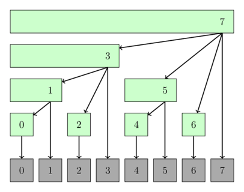

# ფენვიკის ხე

მოდით, $f$ იყოს რაღაც ჯგუფის ოპერაცია (ორობითი ასოციაციური ფუნქცია სიმრავლეზე იდენტურობის ელემენტით და ინვერსიული ელემენტებით) და $A$ იყოს $N$ სიგრძის მთელი რიცხვების მასივი.

ფენვიკის ხე არის მონაცემთა სტრუქტურა, რომელიც:

* ითვლის $f$ ფუნქციის მნიშვნელობას მოცემულ დიაპაზონში $[l, r]$ (ანუ $f(A_l, A_{l+1}, \dots, A_r)$) $O(\log N)$-ში დრო;
* განაახლებს $A$ ელემენტის მნიშვნელობას $O(\log N)$ დროში;
* საჭიროებს $O(N)$ მეხსიერებას, ან სხვა სიტყვებით რომ ვთქვათ, ზუსტად იგივე მეხსიერებას მოითხოვს $A$-ისთვის;
* მარტივი გამოსაყენებელი და კოდირებაა, განსაკუთრებით, მრავალგანზომილებიანი მასივების შემთხვევაში.

Fenwick-ის ხის ყველაზე გავრცელებული გამოყენებაა _დიაპაზონის ჯამის გამოთვლა_ (ანუ შეკრების გამოყენებით მთელი რიცხვების სიმრავლე $\mathbb{Z}$: $f(A_1, A_2, \dots, A_k) = A_1 + A_2 + \dots + A_k$).

ფენვიკის ხეს ასევე უწოდებენ **ორობითი ინდექსირებული ხე**, ან უბრალოდ **BIT** შემოკლებით.

ფენვიკის ხე პირველად აღწერილი იქნა ნაშრომში სათაურით "მონაცემთა ახალი სტრუქტურა კუმულაციური სიხშირის ცხრილებისთვის" (Peter M. Fenwick, 1994).

## აღწერა

### მიმოხილვა

სიმარტივის მიზნით, ჩვენ ვივარაუდებთ, რომ ფუნქცია $f$ არის მხოლოდ *sum ფუნქცია*.

მოცემულია მთელი რიცხვების მასივი $A[0 \წერტილები N-1]$.
ფენვიკის ხე არის მხოლოდ $T[0 \dots N-1]$ მასივი, სადაც მისი თითოეული ელემენტი უდრის $A$ ელემენტების ჯამს რაღაც დიაპაზონში $[g(i), i]$:

$$T_i = \sum_{j = g(i)}^{i}{A_j},$$

სადაც $g$ არის რაღაც ფუნქცია, რომელიც აკმაყოფილებს $0 \le g(i) \le i$.
ჩვენ განვსაზღვრავთ ფუნქციას მომდევნო რამდენიმე აბზაცში.

მონაცემთა სტრუქტურას ეწოდება ხე, რადგან არსებობს მონაცემთა სტრუქტურის ლამაზი წარმოდგენა, როგორც ხე, თუმცა ჩვენ არ გვჭირდება რეალური ხის მოდელირება კვანძებით და კიდეებით.
ჩვენ მხოლოდ $T$-ის მასივის შენარჩუნება დაგვჭირდება, რომ ყველა მოთხოვნა დავამუშავოთ.

**შენიშვნა:** აქ წარმოდგენილი Fenwick ხე იყენებს ნულზე დაფუძნებულ ინდექსირებას.
ბევრი ადამიანი რეალურად გამოიყენებს ფენვიკის ხის ვერსიას, რომელიც იყენებს ერთ დაფუძნებულ ინდექსირებას.
ამიტომ, განხორციელების განყოფილებაში ასევე იპოვით ალტერნატიულ იმპლემენტაციას ერთი დაფუძნებული ინდექსირების გამოყენებით.
ორივე ვერსია ექვივალენტურია დროისა და მეხსიერების სირთულის თვალსაზრისით.

ახლა ჩვენ შეგვიძლია დავწეროთ რამდენიმე ფსევდოკოდი ზემოთ ნახსენები ორი ოპერაციისთვის - მივიღოთ $A$-ის ელემენტების ჯამი $[0, r]$ დიაპაზონში და განაახლოთ (გაზარდოთ) ზოგიერთი ელემენტი $A_i$:

```python
def sum(int r):
    res = 0
    while (r >= 0):
        res += t[r]
        r = g(r) - 1
    return res

def increase(int i, int delta):
    for all j with g(j) <= i <= j:
        t[j] += delta
```

ფუნქცია `sum` მუშაობს შემდეგნაირად:

1. პირველ რიგში, ის ამატებს $[g(r), r]$ (ანუ $T[r]$) დიაპაზონის ჯამს `result`
2. შემდეგ, ის "ხტება" დიაპაზონში $[g(g(r)-1), g(r)-1]$ და ამ დიაპაზონის ჯამს ამატებს `result`
3. და ასე შემდეგ, სანამ არ "გადახტება" $[0, g(g( \dots g(r)-1 \dots -1)-1)]$-მდე $[g(-1), -1] $; სწორედ აქ წყვეტს `sum` ფუნქცია ხტომას.

ფუნქცია `increase` მუშაობს იგივე ანალოგიით, მაგრამ "ხტუნავს" ინდექსების გაზრდის მიმართულებით:

1. $[g(j), j]$ დიაპაზონების ჯამები, რომლებიც აკმაყოფილებს პირობას $g(j) \le i \le j$ გაზრდილია `delta`-ით, ანუ `t[j] += delta` . ამიტომ ჩვენ განვაახლეთ $T$-ში ყველა ელემენტი, რომელიც შეესაბამება დიაპაზონებს, რომლებშიც $A_i$ დევს.


აშკარაა, რომ `sum` და `increase` სირთულე დამოკიდებულია $g$ ფუნქციაზე.
$g$ ფუნქციის არჩევის უამრავი გზა არსებობს, სანამ $0 \le g(i) \le i$ ყველა $i$-ისთვის.
მაგალითად, ფუნქცია $g(i) = i$ მუშაობს, რაც იწვევს მხოლოდ $T = A$ და, შესაბამისად, შემაჯამებელი მოთხოვნები ნელია.
ასევე შეგვიძლია ავიღოთ ფუნქცია $g(i) = 0$.
ეს შეესაბამება პრეფიქსის ჯამების მასივებს, რაც ნიშნავს, რომ $[0, i]$ დიაპაზონის ჯამის პოვნა მხოლოდ მუდმივ დროს მოითხოვს, მაგრამ განახლებები ნელია.
Fenwick-ის ალგორითმის ჭკვიანური ნაწილი ის არის, რომ იქ ის იყენებს $g$ ფუნქციის სპეციალურ განმარტებას, რომელსაც შეუძლია გაუმკლავდეს ორივე ოპერაციას $O(\log N)$ დროში.


### $g(i)$-ის განმარტება

$g(i)$-ის გამოთვლა განისაზღვრება შემდეგი მარტივი ოპერაციის გამოყენებით:
ჩვენ შევცვლით $1$-ის ბოლო ბიტს $i$-ის ორობითი წარმოდგენით $0$ ბიტით.

სხვა სიტყვებით რომ ვთქვათ, თუ $i$-ის ყველაზე ნაკლებად მნიშვნელოვანი ციფრი ბინარში არის $0$, მაშინ $g(i) = i$.
წინააღმდეგ შემთხვევაში, ყველაზე ნაკლებად მნიშვნელოვანი ციფრი არის $1$, ჩვენ ვიღებთ ამ $1$-ს და ყველა სხვა ჩამორჩენილ $1$s-ს და ვაბრუნებთ მათ.

მაგალითად ვიღებთ

$$\begin{align}
g(11) = g(1011_2) = 1000_2 &= 8 \\\\
g(12) = g(1100_2) = 1100_2 &= 12 \\\\
g(13) = g(1101_2) = 1100_2 &= 12 \\\\
g(14) = g(1110_2) = 1110_2 &= 14 \\\\
g(15) = g(1111_2) = 0000_2 &= 0 \\\\
\end{align}$$

არსებობს მარტივი იმპლემენტაცია, რომელიც იყენებს ბიტ ოპერაციებს ზემოთ აღწერილი არატრივიალური ოპერაციებისთვის:

$$g(i) = i ~\&~ (i+1),$$

სადაც $\&$ არის ბიტიური AND ოპერატორი. ძნელი არ არის საკუთარი თავის დარწმუნება, რომ ეს გამოსავალი აკეთებს იგივეს, რაც ზემოთ აღწერილი ოპერაციას.

ახლა ჩვენ უბრალოდ უნდა ვიპოვოთ გზა, რომ გავიმეოროთ ყველა $j$-ზე, ისე, რომ $g(j) \le i \le j$.

ადვილი მისახვედრია, რომ ყველა ასეთი $j$-ის პოვნა შეგვიძლია $i$-ით დაწყებით და ბოლო დაუყენებელი ბიტის გადაბრუნებით.
ჩვენ ამ ოპერაციას დავარქმევთ $h(j)$.
მაგალითად, $i = 10$-ისთვის გვაქვს:

$$\begin{align}
10 &= 0001010_2 \\\\
h(10) = 11 &= 0001011_2 \\\\
h(11) = 15 &= 0001111_2 \\\\
h(15) = 31 &= 0011111_2 \\\\
h(31) = 63 &= 0111111_2 \\\\
\vdots &
\end{align}$$

გასაკვირი არ არის, რომ ასევე არსებობს მარტივი გზა $h$-ის შესასრულებლად ბიტიური ოპერაციების გამოყენებით:

$$h(j) = j ~\|~ (j+1),$$

სადაც $\|$ არის ბიტიური OR ოპერატორი.

შემდეგი სურათი გვიჩვენებს ფენვიკის ხის, როგორც ხეს შესაძლო ინტერპრეტაციას.
ხის კვანძები აჩვენებენ მათ დიაპაზონს.

<center></center>

## განხორციელება

### ჯამის პოვნა ერთგანზომილებიან მასივში

აქ წარმოგიდგენთ ფენვიკის ხის იმპლემენტაციას ჯამური მოთხოვნებისა და ცალკეული განახლებისთვის.

ჩვეულებრივ ფენვიკის ხეს შეუძლია უპასუხოს მხოლოდ $[0, r]$ ტიპის ჯამურ შეკითხვებს `sum(int r)`-ის გამოყენებით, თუმცა ჩვენ ასევე შეგვიძლია ვუპასუხოთ $[l, r]$ ტიპის სხვა შეკითხვებს $-ის ორი ჯამის გამოთვლით. [0, r]$ და $[0, l-1]$ და გამოვაკლოთ ისინი.
ეს მუშავდება `sum(int l, int r)` მეთოდით.


ასევე ეს განხორციელება მხარს უჭერს ორ კონსტრუქტორს.
თქვენ შეგიძლიათ შექმნათ ფენვიკის ხე, რომელიც ინიციალიზებულია ნულებით, ან შეგიძლიათ არსებული მასივი გადაიყვანოთ ფენვიკის ფორმაში.


```{.cpp file=fenwick_sum}
struct FenwickTree {
    vector<int> bit;  // binary indexed tree
    int n;

    FenwickTree(int n) {
        this->n = n;
        bit.assign(n, 0);
    }

    FenwickTree(vector<int> const &a) : FenwickTree(a.size()) {
        for (size_t i = 0; i < a.size(); i++)
            add(i, a[i]);
    }

    int sum(int r) {
        int ret = 0;
        for (; r >= 0; r = (r & (r + 1)) - 1)
            ret += bit[r];
        return ret;
    }

    int sum(int l, int r) {
        return sum(r) - sum(l - 1);
    }

    void add(int idx, int delta) {
        for (; idx < n; idx = idx | (idx + 1))
            bit[idx] += delta;
    }
};
```

### ხაზოვანი კონსტრუქცია

ზემოთ განხორციელებისთვის საჭიროა $O(N \log N)$ დრო.
შესაძლებელია მისი გაუმჯობესება $O(N)$ დრომდე.

იდეა ისაა, რომ რიცხვი $a[i]$ ინდექსში $i$ ხელს შეუწყობს $bit[i]$-ში შენახულ დიაპაზონს და ყველა დიაპაზონს, სადაც ინდექსი $i | (i + 1)$ ხელს უწყობს.
ასე რომ, რიცხვების თანმიმდევრობით მიმატებით, თქვენ მხოლოდ უნდა გადაიტანოთ მიმდინარე ჯამი შემდგომ დიაპაზონში, სადაც ის შემდგომში გადაინაცვლებს შემდეგ დიაპაზონში და ა.შ.

```cpp
FenwickTree(vector<int> const &a) : FenwickTree(a.size()){
    for (int i = 0; i < n; i++) {
        bit[i] += a[i];
        int r = i | (i + 1);
        if (r < n) bit[r] += bit[i];
    }
}
```

### მინიმუმ $[0, r]$-ის პოვნა ერთგანზომილებიან მასივში

აშკარაა, რომ არ არსებობს $[l, r]$ მინიმალური დიაპაზონის პოვნის მარტივი გზა Fenwick ხის გამოყენებით, რადგან ფენვიკის ხეს შეუძლია უპასუხოს მხოლოდ $[0, r]$ ტიპის შეკითხვებს.
გარდა ამისა, ყოველ ჯერზე, როდესაც მნიშვნელობა `update`, ახალი მნიშვნელობა უნდა იყოს უფრო მცირე ვიდრე მიმდინარე მნიშვნელობა.
ორივე მნიშვნელოვანი შეზღუდვა არის იმის გამო, რომ $min$ ოპერაცია მთელი რიცხვების სიმრავლესთან ერთად არ ქმნის ჯგუფს, რადგან არ არსებობს ინვერსიული ელემენტები.

```{.cpp file=fenwick_min}
struct FenwickTreeMin {
    vector<int> bit;
    int n;
    const int INF = (int)1e9;

    FenwickTreeMin(int n) {
        this->n = n;
        bit.assign(n, INF);
    }

    FenwickTreeMin(vector<int> a) : FenwickTreeMin(a.size()) {
        for (size_t i = 0; i < a.size(); i++)
            update(i, a[i]);
    }

    int getmin(int r) {
        int ret = INF;
        for (; r >= 0; r = (r & (r + 1)) - 1)
            ret = min(ret, bit[r]);
        return ret;
    }

    void update(int idx, int val) {
        for (; idx < n; idx = idx | (idx + 1))
            bit[idx] = min(bit[idx], val);
    }
};
```

შენიშვნა: შესაძლებელია Fenwick-ის ხის დანერგვა, რომელსაც შეუძლია გაუმკლავდეს თვითნებური მინიმალური დიაპაზონის შეკითხვებს და თვითნებურ განახლებებს.
ნაშრომი [Efficient Range Minimum Queries using Binary Indexed Trees](http://ioinformatics.org/oi/pdf/v9_2015_39_44.pdf) აღწერს ასეთ მიდგომას.
თუმცა ამ მიდგომით თქვენ უნდა შეინარჩუნოთ მეორე ბინარული ინდექსირებული ხე მონაცემებზე, ოდნავ განსხვავებული სტრუქტურით, რადგან ერთი ხე არ არის საკმარისი მასივის ყველა ელემენტის მნიშვნელობების შესანახად.
დანერგვა ასევე ბევრად უფრო რთულია თანხების ნორმალურ განხორციელებასთან შედარებით.

### ჯამის პოვნა ორგანზომილებიან მასივში

როგორც ადრე ითქვა, ძალიან მარტივია Fenwick Tree-ის დანერგვა მრავალგანზომილებიანი მასივისთვის.

```cpp
struct FenwickTree2D {
    vector<vector<int>> bit;
    int n, m;

    // init(...) { ... }

    int sum(int x, int y) {
        int ret = 0;
        for (int i = x; i >= 0; i = (i & (i + 1)) - 1)
            for (int j = y; j >= 0; j = (j & (j + 1)) - 1)
                ret += bit[i][j];
        return ret;
    }

    void add(int x, int y, int delta) {
        for (int i = x; i < n; i = i | (i + 1))
            for (int j = y; j < m; j = j | (j + 1))
                bit[i][j] += delta;
    }
};
```

### ერთი დაფუძნებული ინდექსირების მიდგომა

ამ მიდგომისთვის ჩვენ ცოტათი ვცვლით $T[]$-ის და $g()$-ის მოთხოვნებს და განმარტებას.
ჩვენ გვინდა, რომ $T[i]$-მა შეინახოს $[g(i)+1-ის ჯამი; i]$.
ეს ცოტათი ცვლის განხორციელებას და იძლევა $g(i)$-ის მსგავსი ლამაზი განმარტების საშუალებას:

```python
def sum(int r):
    res = 0
    while (r > 0):
        res += t[r]
        r = g(r)
    return res

def increase(int i, int delta):
    for all j with g(j) < i <= j:
        t[j] += delta
```

$g(i)$-ის გამოთვლა განისაზღვრება როგორც:
ბოლო ნაკრების გადართვა $1$ ბიტი $i$-ის ბინარულ წარმომადგენლობაში.

$$\begin{align}
g(7) = g(111_2) = 110_2 &= 6 \\\\
g(6) = g(110_2) = 100_2 &= 4 \\\\
g(4) = g(100_2) = 000_2 &= 0 \\\\
\end{align}$$

ბოლო ნაკრების ბიტის ამოღება შესაძლებელია $i ~\&~ (-i)$-ის გამოყენებით, ასე რომ ოპერაცია შეიძლება გამოისახოს როგორც:


$$g(i) = i - (i ~\&~ (-i)).$$

და ძნელი მისახვედრი არ არის, რომ თქვენ უნდა შეცვალოთ ყველა მნიშვნელობა $T[j]$ თანმიმდევრობით $i,~ h(i),~ h(h(i)),~ \dots$ როდესაც გსურთ განახლება. $A[j]$, სადაც $h(i)$ განისაზღვრება, როგორც:

$$h(i) = i + (i ~\&~ (-i)).$$

როგორც ხედავთ, ამ მიდგომის მთავარი უპირატესობა ის არის, რომ ორობითი ოპერაციები ძალიან კარგად ავსებენ ერთმანეთს.

შემდეგი დანერგვა შეიძლება გამოყენებულ იქნას სხვა განხორციელებების მსგავსად, თუმცა ის იყენებს ერთ დაფუძნებულ ინდექსირებას შიდა.

```{.cpp file=fenwick_sum_onebased}
struct FenwickTreeOneBasedIndexing {
    vector<int> bit;  // binary indexed tree
    int n;

    FenwickTreeOneBasedIndexing(int n) {
        this->n = n + 1;
        bit.assign(n + 1, 0);
    }

    FenwickTreeOneBasedIndexing(vector<int> a)
        : FenwickTreeOneBasedIndexing(a.size()) {
        for (size_t i = 0; i < a.size(); i++)
            add(i, a[i]);
    }

    int sum(int idx) {
        int ret = 0;
        for (++idx; idx > 0; idx -= idx & -idx)
            ret += bit[idx];
        return ret;
    }

    int sum(int l, int r) {
        return sum(r) - sum(l - 1);
    }

    void add(int idx, int delta) {
        for (++idx; idx < n; idx += idx & -idx)
            bit[idx] += delta;
    }
};
```

## დიაპაზონის ოპერაციები

ფენვიკის ხეს შეუძლია შემდეგი დიაპაზონის ოპერაციების მხარდაჭერა:

1. Point Update and Range Query
2. Range Update and Point Query
3. Range Update and Range Query

### 1. წერტილის განახლება და დიაპაზონის მოთხოვნა

ეს მხოლოდ ჩვეულებრივი ფენვიკის ხეა, როგორც ზემოთ იყო ახსნილი.

### 2. დიაპაზონის განახლება და წერტილის მოთხოვნა

მარტივი ხრიკების გამოყენებით ჩვენ ასევე შეგვიძლია გავაკეთოთ საპირისპირო ოპერაციები: დიაპაზონების გაზრდა და ცალკეული მნიშვნელობების მოთხოვნა.

დაე, ფენვიკის ხე იყოს ინიციალიზაცია ნულებით.
დავუშვათ, რომ გვინდა გავზარდოთ $[l, r]$ ინტერვალი $x$-ით.
ჩვენ ვაკეთებთ ორ პუნქტიანი განახლების ოპერაციებს Fenwick ხეზე, რომლებიც არის `add(l, x)` და `add(r+1, -x)`.

თუ გვინდა მივიღოთ $A[i]$-ის მნიშვნელობა, უბრალოდ უნდა ავიღოთ პრეფიქსი ჯამი ჩვეულებრივი დიაპაზონის ჯამის მეთოდის გამოყენებით.
იმის გასაგებად, თუ რატომ არის ეს ასე მართალი, ჩვენ შეგვიძლია ისევ ფოკუსირება მოახდინოთ წინა გაზრდის ოპერაციაზე.
თუ $i < l$, მაშინ ორი განახლების ოპერაცია არ მოქმედებს მოთხოვნაზე და მივიღებთ თანხას $0$.
თუ $i \in [l, r]$, მაშინ ჩვენ ვიღებთ პასუხს $x$ პირველი განახლების ოპერაციის გამო.
და თუ $i > r$, მაშინ მეორე განახლების ოპერაცია გააუქმებს პირველის ეფექტს.

შემდეგი განხორციელება იყენებს ერთ დაფუძნებულ ინდექსირებას.

```cpp
void add(int idx, int val) {
    for (++idx; idx < n; idx += idx & -idx)
        bit[idx] += val;
}

void range_add(int l, int r, int val) {
    add(l, val);
    add(r + 1, -val);
}

int point_query(int idx) {
    int ret = 0;
    for (++idx; idx > 0; idx -= idx & -idx)
        ret += bit[idx];
    return ret;
}
```

შენიშვნა: რა თქმა უნდა, ასევე შესაძლებელია $A[i]$-ის ერთი წერტილის გაზრდა `range_add(i, i, val)`-ით.

### 3. დიაპაზონის განახლებები და დიაპაზონის მოთხოვნები

დიაპაზონის განახლებებისა და დიაპაზონის მოთხოვნების მხარდასაჭერად ჩვენ გამოვიყენებთ ორ BIT-ს, კერძოდ, $B_1[]$ და $B_2[]$, ინიციალიზებულს ნულებით.

დავუშვათ, რომ გვინდა გავზარდოთ $[l, r]$ ინტერვალი $x$ მნიშვნელობით.
ისევე, როგორც წინა მეთოდში, ჩვენ ვასრულებთ ორ პუნქტიან განახლებებს $B_1$-ზე: `add(B1, l, x)` და `add(B1, r+1, -x)`.
ჩვენ ასევე ვაახლებთ $B_2$. დეტალები მოგვიანებით იქნება ახსნილი.

```python
def range_add(l, r, x):
    add(B1, l, x)
    add(B1, r+1, -x)
    add(B2, l, x*(l-1))
    add(B2, r+1, -x*r))
```
დიაპაზონის $(l, r, x)$ განახლების შემდეგ დიაპაზონის ჯამის მოთხოვნამ უნდა დააბრუნოს შემდეგი მნიშვნელობები:

$$
sum[0, i]=
\begin{cases}
0 & i < l \\\\
x \cdot (i-(l-1)) & l \le i \le r \\\\
x \cdot (r-l+1) & i > r \\\\
\end{cases}
$$

ჩვენ შეგვიძლია დავწეროთ დიაპაზონის ჯამი, როგორც ორი ტერმინის სხვაობა, სადაც ვიყენებთ $B_1$ პირველი წევრისთვის და $B_2$ მეორე წევრისთვის.
მოთხოვნების სხვაობა მოგვცემს პრეფიქსის ჯამს $[0, i]$-ზე.

$$\begin{align}
sum[0, i] &= sum(B_1, i) \cdot i - sum(B_2, i) \\\\
&= \begin{cases}
0 \cdot i - 0 & i < l\\\\
x \cdot i - x \cdot (l-1) & l \le i \le r \\\\
0 \cdot i - (x \cdot (l-1) - x \cdot r) & i > r \\\\
\end{cases}
\end{align}
$$

ბოლო გამონათქვამი ზუსტად უდრის საჭირო ტერმინებს.
ამრიგად, ჩვენ შეგვიძლია გამოვიყენოთ $B_2$ დამატებითი პირობების გასაპარსად, როდესაც გავამრავლებთ $B_1[i]\ჯერ i$-ზე.

ჩვენ შეგვიძლია ვიპოვოთ თვითნებური დიაპაზონის ჯამები $l-1$-სა და $r$-ის პრეფიქსის ჯამების გამოთვლით და მათ შორის სხვაობის ხელახლა აღებით.

```python
def add(b, idx, x):
    while idx <= N:
        b[idx] += x
        idx += idx & -idx

def range_add(l,r,x):
    add(B1, l, x)
    add(B1, r+1, -x)
    add(B2, l, x*(l-1))
    add(B2, r+1, -x*r)

def sum(b, idx):
    total = 0
    while idx > 0:
        total += b[idx]
        idx -= idx & -idx
    return total

def prefix_sum(idx):
    return sum(B1, idx)*idx -  sum(B2, idx)

def range_sum(l, r):
    return prefix_sum(r) - prefix_sum(l-1)
```

## სავარჯიშო

* [UVA 12086 - Potentiometers](https://uva.onlinejudge.org/index.php?option=com_onlinejudge&Itemid=8&category=24&page=show_problem&problem=3238)
* [LOJ 1112 - Curious Robin Hood](http://www.lightoj.com/volume_showproblem.php?problem=1112)
* [LOJ 1266 - Points in Rectangle](http://www.lightoj.com/volume_showproblem.php?problem=1266 "2D Fenwick Tree")
* [Codechef - SPREAD](http://www.codechef.com/problems/SPREAD)
* [SPOJ - CTRICK](http://www.spoj.com/problems/CTRICK/)
* [SPOJ - MATSUM](http://www.spoj.com/problems/MATSUM/)
* [SPOJ - DQUERY](http://www.spoj.com/problems/DQUERY/)
* [SPOJ - NKTEAM](http://www.spoj.com/problems/NKTEAM/)
* [SPOJ - YODANESS](http://www.spoj.com/problems/YODANESS/)
* [SRM 310 - FloatingMedian](https://community.topcoder.com/stat?c=problem_statement&pm=6551&rd=9990)
* [SPOJ - Ada and Behives](http://www.spoj.com/problems/ADABEHIVE/)
* [Hackerearth - Counting in Byteland](https://www.hackerearth.com/practice/data-structures/advanced-data-structures/fenwick-binary-indexed-trees/practice-problems/algorithm/counting-in-byteland/)
* [DevSkill - Shan and String (archived)](http://web.archive.org/web/20210322010617/https://devskill.com/CodingProblems/ViewProblem/300)
* [Codeforces - Little Artem and Time Machine](http://codeforces.com/contest/669/problem/E)
* [Codeforces - Hanoi Factory](http://codeforces.com/contest/777/problem/E)
* [SPOJ - Tulip and Numbers](http://www.spoj.com/problems/TULIPNUM/)
* [SPOJ - SUMSUM](http://www.spoj.com/problems/SUMSUM/)
* [SPOJ - Sabir and Gifts](http://www.spoj.com/problems/SGIFT/)
* [SPOJ - The Permutation Game Again](http://www.spoj.com/problems/TPGA/)
* [SPOJ - Zig when you Zag](http://www.spoj.com/problems/ZIGZAG2/)
* [SPOJ - Cryon](http://www.spoj.com/problems/CRAYON/)
* [SPOJ - Weird Points](http://www.spoj.com/problems/DCEPC705/)
* [SPOJ - Its a Murder](http://www.spoj.com/problems/DCEPC206/)
* [SPOJ - Bored of Suffixes and Prefixes](http://www.spoj.com/problems/KOPC12G/)
* [SPOJ - Mega Inversions](http://www.spoj.com/problems/TRIPINV/)
* [Codeforces - Subsequences](http://codeforces.com/contest/597/problem/C)
* [Codeforces - Ball](http://codeforces.com/contest/12/problem/D)
* [GYM - The Kamphaeng Phet's Chedis](http://codeforces.com/gym/101047/problem/J)
* [Codeforces - Garlands](http://codeforces.com/contest/707/problem/E)
* [Codeforces - Inversions after Shuffle](http://codeforces.com/contest/749/problem/E)
* [GYM - Cairo Market](http://codeforces.com/problemset/gymProblem/101055/D)
* [Codeforces - Goodbye Souvenir](http://codeforces.com/contest/849/problem/E)
* [SPOJ - Ada and Species](http://www.spoj.com/problems/ADACABAA/)
* [Codeforces - Thor](https://codeforces.com/problemset/problem/704/A)
* [CSES - Forest Queries II](https://cses.fi/problemset/task/1739/)
* [Latin American Regionals 2017 - Fundraising](http://matcomgrader.com/problem/9346/fundraising/)

## სხვა რესურსები

* [Fenwick tree on Wikipedia](http://en.wikipedia.org/wiki/Fenwick_tree)
* [Binary indexed trees tutorial on TopCoder](https://www.topcoder.com/community/data-science/data-science-tutorials/binary-indexed-trees/)
* [Range updates and queries ](https://programmingcontests.quora.com/Tutorial-Range-Updates-in-Fenwick-Tree)
